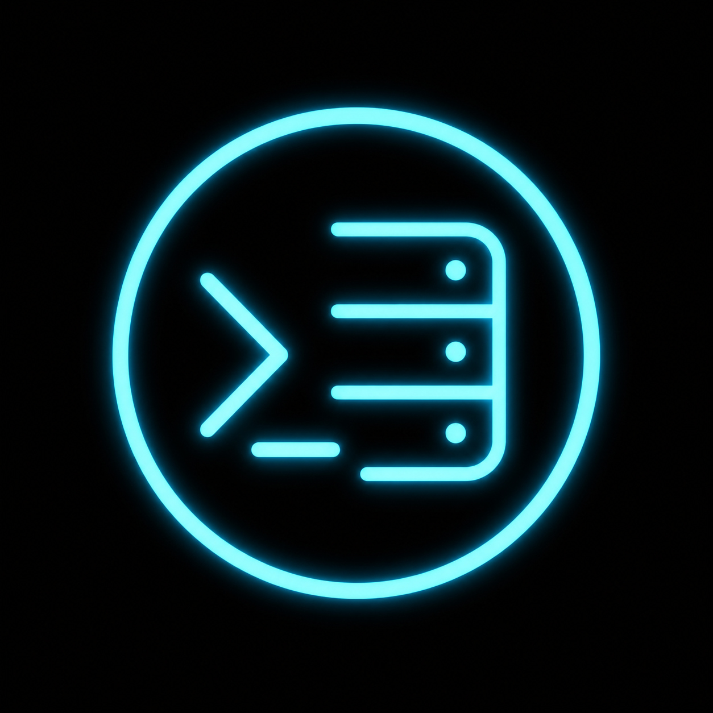

<div align="center">
  
  <h1>Glyph</h1>
  <p><strong>A Modern, Agentic SSH & Server Management Client</strong></p>
  <p>Built for speed, security, and elegance.</p>
</div>

---

## 🚀 Overview

**Glyph** is a sleek, modern desktop application designed to streamline server management. Built entirely on web technologies, it serves as an all-in-one hub for interacting with remote servers. Whether you are monitoring system metrics, managing Docker containers, executing quick commands, or dropping into a full-featured terminal, Glyph provides a premium, responsive, and beautiful interface.

## ✨ Features

- **Secure Server Vault:** Save and manage multiple SSH configurations securely on your local machine.
- **ZeroTier Integration:** Connect seamlessly to servers inside private ZeroTier networks natively—without needing the ZeroTier client installed on your host machine.
- **Live Dashboard:** Real-time visual metrics for CPU, Memory, Disk I/O, and Network traffic parsed directly from the server.
- **Full-Featured Terminal:** A fast, xterm.js-powered terminal for unrestricted shell access.
- **Visual SFTP Manager:** Browse, upload, download, rename, and delete files with a beautiful dual-pane-like UI.
- **Docker Management:** Instantly view, start, stop, and remove Docker containers right from the GUI.
- **Command Snippets:** Save, organize, and execute frequently used shell commands with one click.
- **OS Detection:** Automatically identifies your server's OS (Ubuntu, Debian, CentOS, etc.) and displays the correct iconography.

## 🛠 Tech Stack

Glyph is engineered using a modern, robust technology stack:

- **Framework:** [Electron](https://www.electronjs.org/) for cross-platform desktop capabilities.
- **Frontend UI:** [React 18](https://reactjs.org/) + [Vite](https://vitejs.dev/) for lightning-fast HMR and optimized builds.
- **Styling:** [Tailwind CSS](https://tailwindcss.com/) for a sleek, responsive, and highly customizable glassmorphism design system.
- **SSH Protocol:** `ssh2` & `ssh2-sftp-client` for reliable, low-level shell and file transfers.
- **Terminal Emulator:** `xterm.js` and `xterm-addon-fit` for pixel-perfect terminal rendering.
- **Networking:** `libzt` (ZeroTier Sockets) for native, direct peer-to-peer networking.
- **Icons & Graphics:** [Lucide React](https://lucide.dev/) and [Devicon](https://devicon.dev/).

## 🖥 Getting Started

### Prerequisites
- [Node.js](https://nodejs.org/) (v18 or higher recommended)
- [Git](https://git-scm.com/)

### Installation

1. **Clone the repository:**
   ```bash
   git clone https://github.com/TheLunatic1/Glyph.git
   cd Glyph
   ```

2. **Install dependencies:**
   ```bash
   npm install
   ```

3. **Run the development server:**
   ```bash
   npm run dev
   ```
   *This will start the Vite dev server for the React frontend and spawn the Electron application.*

4. **Build for production:**
   ```bash
   npm run build
   ```

## 🎨 UI & Aesthetics
Glyph was designed from the ground up to feel premium. We discarded generic, boring terminal interfaces in favor of a **Dark Mode First** design, featuring tailored HSL color palettes, subtle micro-animations, glassmorphism panels, and smooth transitions. The goal is to make server administration not just a task, but an experience.

## 🤝 Contributing
Contributions, issues, and feature requests are welcome! Feel free to check the [issues page](https://github.com/TheLunatic1/Glyph/issues) if you want to contribute.

## 📄 License
This project is licensed under the MIT License - see the [LICENSE](LICENSE) file for details.

---
<div align="center">
  <p>Made by <a href="https://github.com/TheLunatic1">TheLunatic1</a></p>
</div>
